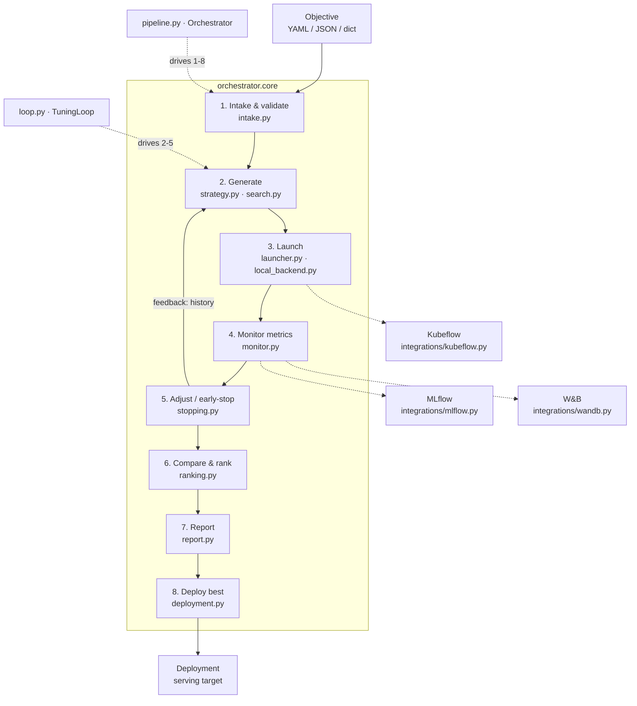

# Architecture

The orchestrator implements an eight-stage experimentation lifecycle. Each stage
is a small, independently usable module in `orchestrator.core`; the
`Orchestrator` (in `pipeline.py`) wires them into the end-to-end flow, and the
optional `orchestrator.integrations` packages plug in at well-defined seams.

## Lifecycle



(If your viewer doesn't render Mermaid, the same flow in text:
`intake → generate → launch → monitor → adjust ↺ → compare → report → deploy`,
where **adjust** feeds run history back into **generate**.)

## Modules at a glance

| Stage | Module | Key types |
|-------|--------|-----------|
| — | `models.py` | `Objective`, `Experiment`, `HyperparameterSpec`, `MetricValue`, `Goal`, `ExperimentStatus` |
| — | `config.py` | `load_objective`, `objective_from_dict` |
| 1 | `intake.py` | `intake_objective`, `validate_objective`, `ValidationReport` |
| 2 | `strategy.py`, `search.py` | `ExperimentStrategy` (+ registry), `RandomSearch`, `GridSearch` |
| 3 | `launcher.py`, `local_backend.py` | `TrainingLauncher`, `TrainingJob`, `TrainingResult`, `LocalLauncher`, `TrainContext` |
| 4 | `monitor.py` | `MetricMonitor`, `MetricEvent`, `MetricListener`, `MetricHistory`, `BestMetricTracker` |
| 5 | `stopping.py` | `EarlyStopper`, `*Policy`, `EarlyStoppingListener`, `StopDecision` |
| 2–5 | `loop.py` | `TuningLoop`, `TuningResult`, `run_local` |
| 6 | `ranking.py` | `rank_result`, `Leaderboard`, `RankedExperiment`, `compare_experiments` |
| 7 | `report.py` | `Report`, `build_report`, `generate_report`, `write_report` |
| 8 | `deployment.py` | `DeploymentTarget` (+ registry), `LocalDeploymentTarget`, `select_best`, `deploy_best` |
| 1–8 | `pipeline.py` | `Orchestrator`, `PipelineResult`, `run_pipeline` |

## Design principles

**Registries for pluggability.** Strategies, launchers, and deployment targets
each share the same pattern: a small ABC, a `@register_*` decorator, and
`get_*` / `available_*` lookups. New backends drop in without touching the core.

```text
ExperimentStrategy ── register_strategy / get_strategy / available_strategies
TrainingLauncher   ── register_launcher  / get_launcher  / available_launchers
DeploymentTarget   ── register_target    / get_target    / available_targets
```

**A launcher lifecycle that fits sync and async.** Backends implement
`launch → poll → result → cancel`. The in-process `LocalLauncher` runs on a
thread pool (real concurrency, live metric streaming, cooperative cancellation);
`KubeflowLauncher` submits pipeline runs and polls their state — same interface.

**Monitoring as an observable stream.** `MetricMonitor` diffs each job's metrics
and emits `MetricEvent`s, consumed either by **push** listeners (`MetricHistory`,
`BestMetricTracker`, `EarlyStoppingListener`, `MlflowListener`, `WandbListener`)
or by **pull** iteration (`monitor.stream()`). Backends that can't stream still
surface their metrics in one batch at completion.

**The feedback loop.** `TuningLoop` passes the accumulated run history into
`strategy.propose(...)` on every round. Random and grid search ignore it; an
adaptive strategy (e.g. Bayesian optimization) reads it. The adaptiveness lives
in the data the loop provides, not in the loop itself.

**Optional dependencies, never at import time.** Integration modules import
their heavy dependency (`mlflow`, `wandb`, `kfp`) lazily, so the package imports
cleanly without them and raises a clear, actionable error only on first use.
`orchestrator.core` never imports `orchestrator.integrations`.

## Data flow types

```text
Objective ──(strategy)──▶ Experiment[] ──(launcher)──▶ TrainingJob
TrainingJob ──(poll/result)──▶ TrainingResult ──(apply_result)──▶ Experiment(metrics, status)
Experiment[] ──(ranking)──▶ Leaderboard ──(report)──▶ Report
Leaderboard.best ──(deployment)──▶ Deployment
```
